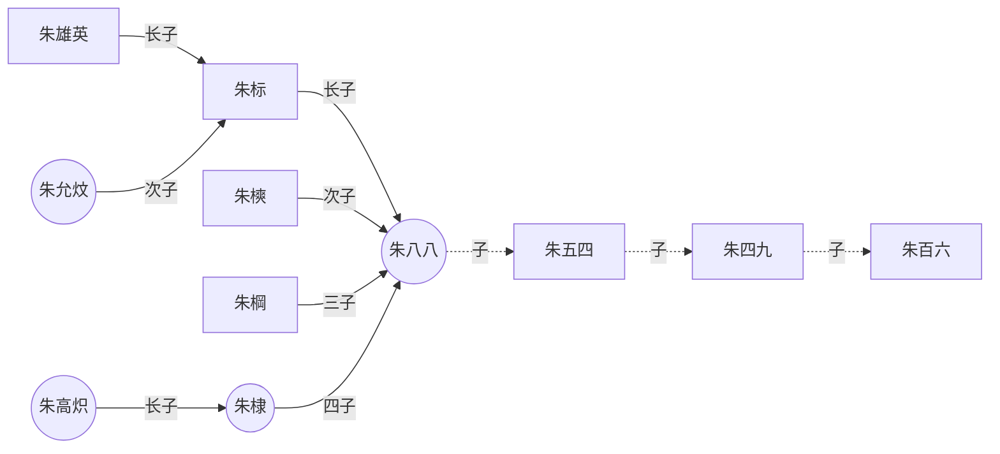
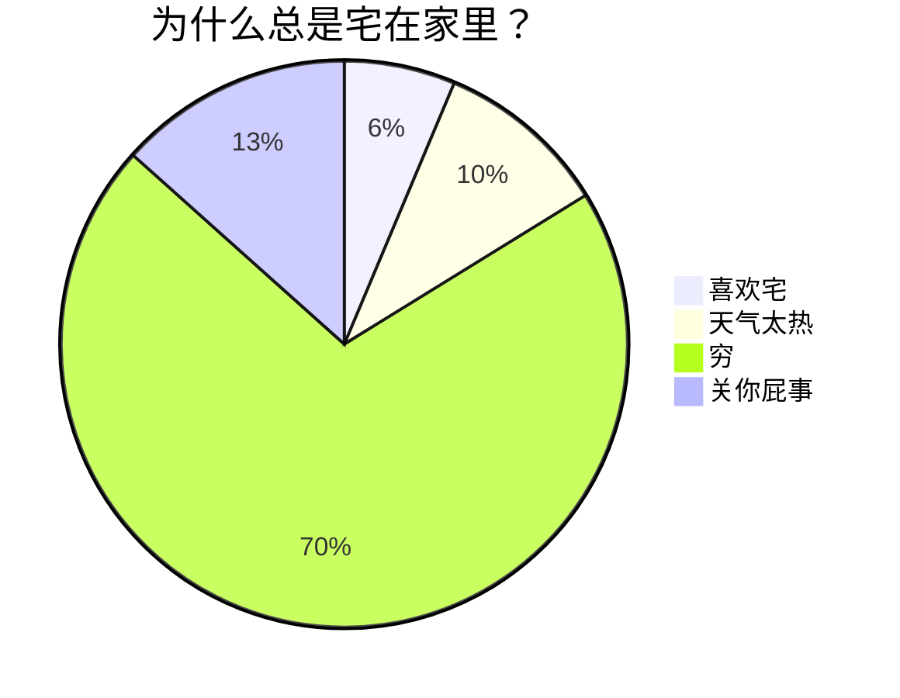
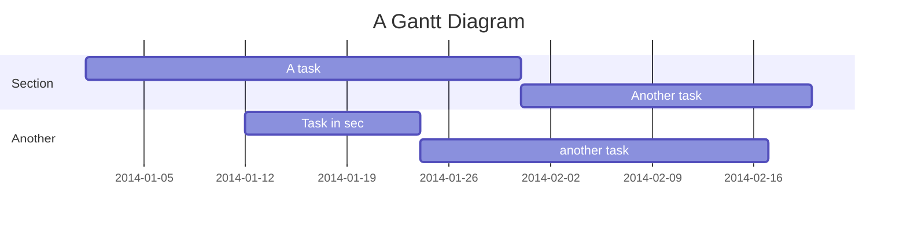

- 一些 **MD编辑器** 和 **笔记软件** 支持通过 [**Mermaid** 64](https://mermaid-js.github.io/ "Mermaid官网") 及其所提供的 [编译器 21](https://mermaid-js.github.io/mermaid-live-editor "Mermaid在线编译器") 来为用户提供图表的绘制功能
    
- 这里只提供一些演示的图表，具体教程可戳下方链接
    
    - [Mermaid详细教程 390](https://zhuanlan.zhihu.com/p/355997933 "知乎Mermaid教程")

  

### 19.1 [[流程图]]

- **源码：**

````

````

**渲染：**

[](https://forum-zh.obsidian.md/uploads/default/original/1X/1d45d0418552fc61e2791604f981c69761cfa6b0.png "mermaid 流程图")
### 19.2 [[饼图]]

- **源码：**

````

````

**渲染：**

[](https://forum-zh.obsidian.md/uploads/default/original/1X/c0bb1ec053714409c4dcd5b68426be4cae47f1be.png "mermaid 饼图")

  

### 19.3 [[顺序图 (时序图)]]

- **源码：**

````
```mermaid
sequenceDiagram
	%% 自动编号
	autonumber
	%% 定义参与者并取别名，aliases：别名
        participant A as Aly
        participant B as Bob
        participant C as CofCai
        %% 便签说明
        Note left of A: 只复习了一部分
        Note right of B: 没复习
        Note over A,B: are contacting
        
        A->>B: 明天是要考试吗？
        B-->>A: 好像是的！
        
        %% 显示并行发生的动作，parallel：平行
        %% par [action1]
        rect rgb(0, 25, 155)
            par askA
                C -->> A:你复习好了吗？
            and askB
                C -->> B:你复习好了吗？
            and self
                C ->>C:我还没准备复习......
            end
        end
        
        %% 背景高亮，提供一个有颜色的背景矩形
        rect rgb(25, 55, 0)
            loop 自问/Every min
            %% <br/>可以换行
            C ->> C:我什么时候<br/>开始复习呢？
            end
        end
        
        %% 可选择路径
        rect rgb(153, 83, 60)
            alt is good
                A ->> C:复习了一点
            else is common
                B ->> C:我也是
            end
            %% 没有else时可以提供默认的opt
            opt Extra response
                C ->> C:你们怎么不回答我
            end
        endsequenceDiagram
	%% 自动编号
	autonumber
	%% 定义参与者并取别名，aliases：别名
        participant A as Aly
        participant B as Bob
        participant C as CofCai
        %% 便签说明
        Note left of A: 只复习了一部分
        Note right of B: 没复习
        Note over A,B: are contacting
        
        A->>B: 明天是要考试吗？
        B-->>A: 好像是的！
        
        %% 显示并行发生的动作，parallel：平行
        %% par [action1]
        rect rgb(0, 25, 155)
            par askA
                C -->> A:你复习好了吗？
            and askB
                C -->> B:你复习好了吗？
            and self
                C ->>C:我还没准备复习......
            end
        end
        
        %% 背景高亮，提供一个有颜色的背景矩形
        rect rgb(25, 55, 0)
            loop 自问/Every min
            %% <br/>可以换行
            C ->> C:我什么时候<br/>开始复习呢？
            end
        end
        
        %% 可选择路径
        rect rgb(153, 83, 60)
            alt is good
                A ->> C:复习了一点
            else is common
                B ->> C:我也是
            end
            %% 没有else时可以提供默认的opt
            opt Extra response
                C ->> C:你们怎么不回答我
            end
        end
```
````

**渲染：**

[](https://forum-zh.obsidian.md/uploads/default/original/1X/5a9de2149386fa6b665119d4eb2365cc629809bf.png "mermaid 时序图")

  
  

### 19.4 [[甘特图]]

- **源码：**

````

````

**渲染：**

[](https://forum-zh.obsidian.md/uploads/default/original/1X/055649b00d70ed0fb49752c7192a67f23b049211.png "mermaid 甘特图")